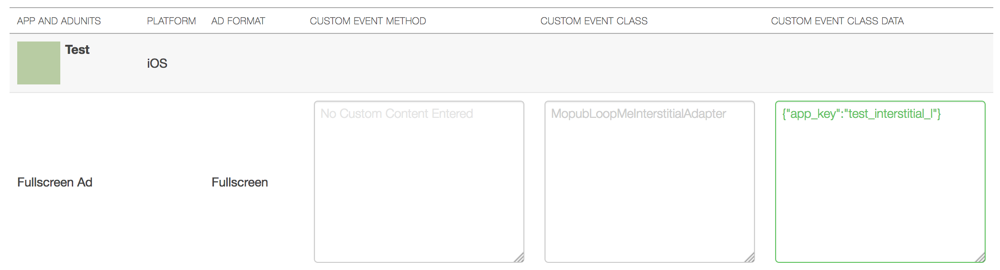
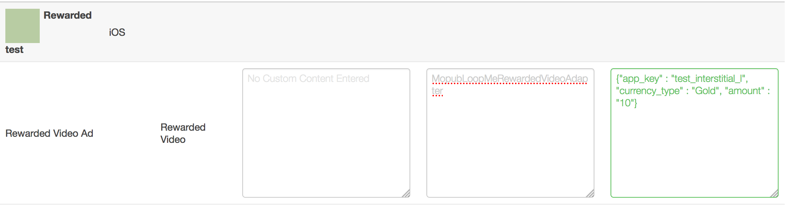

# LoopMe Mopub Mediation plugin for Unity 

## Only iOS!

The `LoopMe` bridge allows you to mediate between `Mopub` interstitial ads and `LoopMe` interstitial ads in your Unity App

### Create and configure custom native network on Mopub dashboard ###

In order to mediate between Mopub interstitial ads and LoopMe interstitial ads you have to configure networks waterfall.
<b>NOTE:</b> `LoopMe` is not available as a predefine network in the Mopub tool, SDK bridge needs to be manually configured with Mopub "Custom Native Network" option.

* On Mopub dashboard click Networks -> add a network. Choose `Custom Native Network`
* Configure `Custom Network` in the following way:

<b>custom event class</b>: MopubLoopMeInterstitialAdapter  
<b>custom event class data</b>: {"app_key" : "YOUR_APP_KEY"}   
<b>NOTE:</b> You will get a unique app_key from the `LoopMe` dashboard when registering your ad spot. For test you can use `loopme_interstitial_l`.

### Adding LoopMe SDK to your project ###

* Download `LoopMeMopubUnityPlugin` from this repository
* Import into your Unity project.

# LoopMe Mopub Rewarded Video Ad Bridge

The `LoopMe` bridge allows you to mediate between `Mopub` Rewarded Video ads and `LoopMe` Rewarded Video ads.

### Create and configure custom native network on Mopub dashboard ###

In order to mediate between Mopub Rewarded Video ads and LoopMe Rewarded Video ads you have to configure networks waterfall.
<b>NOTE:</b> `LoopMe` is not available as a predefine network in the Mopub tool, SDK bridge needs to be manually configured with Mopub "Custom Native Network" option.

* On Mopub dashboard click Networks -> add a network. Choose `Custom Native Network`
* Configure `Custom Network` in the following way:

<b>custom event class</b>: MopubLoopMeRewardedVideoAdapter  
<b>custom event class data</b>: {"app_key" : "YOUR_APP_KEY", "currency_type" : "YOUR_CURRENCY_TYPE", "amount" : "YOUR_AMOUNT"}   
<b>NOTE:</b> You will get a unique app_key from the `LoopMe` dashboard when registering your ad spot. For test you can use `loopme_interstitial_l`.

### Adding LoopMe SDK to your project ###

* Download `LoopMeMopubUnityPlugin` from this repository
* Import into your Unity project.

More information about Mopub Unity:

[https://www.mopub.com/resources/docs/unity-engine-integration/](https://www.mopub.com/resources/docs/unity-engine-integration/)